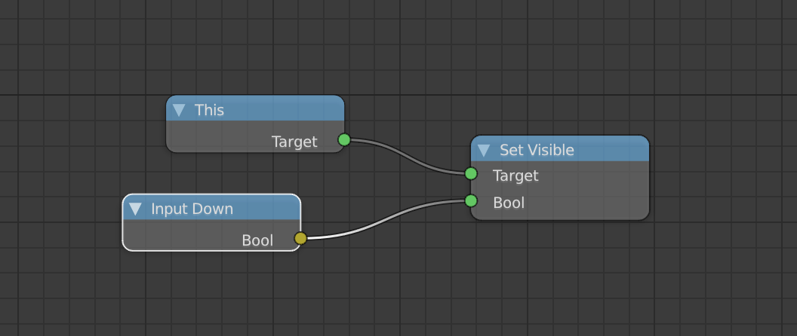

# Creating logic nodes

Currently, Armory sources have to be edited to add new logic nodes. This will be resolved in the future.

We will create a logic node with single boolean output. This node will return true if input is down - for example mouse/gamepad button is pressed or display is being touched.

If you decide to follow this process make sure to use different class name, to prevent name conflicts.

- Locate Armory sources at *Armory/armory_sdk/armory* 
- Open *blender/nodes_logic.py*
- Create a node class with single bool output 

```py
class InputDownNode(Node, ArmLogicTreeNode):
	'''Input down node'''
	bl_idname = 'InputDownNodeType'
	bl_label = 'Input Down'

	def init(self, context):
		self.outputs.new('NodeSocketBool', "Bool")
```

- At the bottom, we will add the class to *input* category. This way node will get registered and displayed in Blender.

```py
LogicNodeCategory("LOGICINPUTNODES", "Input", items=[
		NodeItem("InputDownNodeType"),
]),
```

- We will implement node logic in Haxe. Create new file named *InputDownNode.hx* at *Sources/armory/logicnode*.

```haxe
package armory.logicnode;

import armory.system.Input;
import armory.trait.internal.NodeExecutor;

class InputDownNode extends BoolNode {
	
	// Custom node values
	var lastVal = false;

	public function new() {
		super();
	}

	public override function start(executor:NodeExecutor, parent:Node = null) {
		super.start(executor, parent);
		
		// Register update handler
		executor.notifyOnNodeUpdate(update);
	}

	function update() {
		// Input state changed
		if (lastVal != Input.down) {
			lastVal = val;
			val = Input.down;
			// Notify that value of this node changed
			inputChanged();
		}
	}

	public static function create(value:Float) {
		var n = new InputDownNode();
		return n;
	}
}
```

- At the time of writing, restarting Blender is required to register Python changes.

- Attach node tree below to any object in the scene. When you run the project in Armory, this object will be visible only when mouse button is down.


