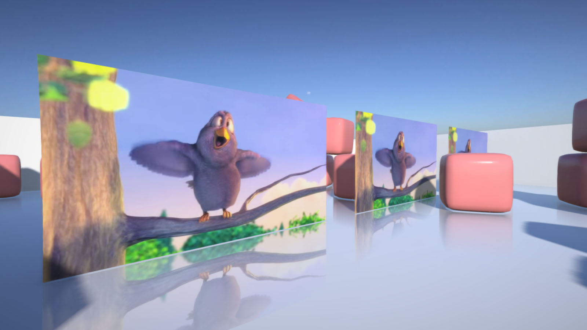
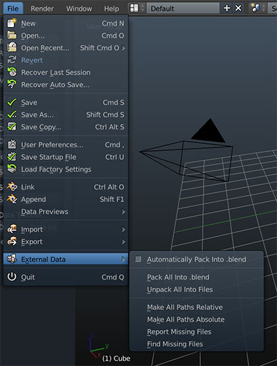

# Assets management

## Tracking assets
You can drop in textures and sounds from any location. However, it is recommended to create an */Assets* directory in your project location and store assets here for convenience. All model data is stored directly in Blender.

When deploying, assets are stored alongside the project. Armory only processes assets that are referenced.

## Supported formats
Referenced assets should be in the formats below. When building, assets get processed and may end up in different format based on target platform to save space or boost performance. That means the .wav files can still end up as .ogg's.

- Images - .png, .jpg, .hdr
- Sounds - .wav
- Videos - .mp4

Eventually, more formats will be supported and converted internally using Blender.

To process video, specify path to *ffmpeg binary* (not bundled with SDK) in add-on preferences.

## Packed assets
Armory supports assets packed directly in Blender. When building, the assets are unpacked to build folder automatically. This way you can pack your project into single .blend file with no external dependencies.

## Texture dimensions

At least *4096x4096* texture sizes can be used on most modern systems.  

For HTML5 target, power of 2 textures are required in some cases:
- Using *repeat* texture mode. *Clip* mode can be safely used with non-power of 2 sizes.

In the future Armory will handle this internally.
