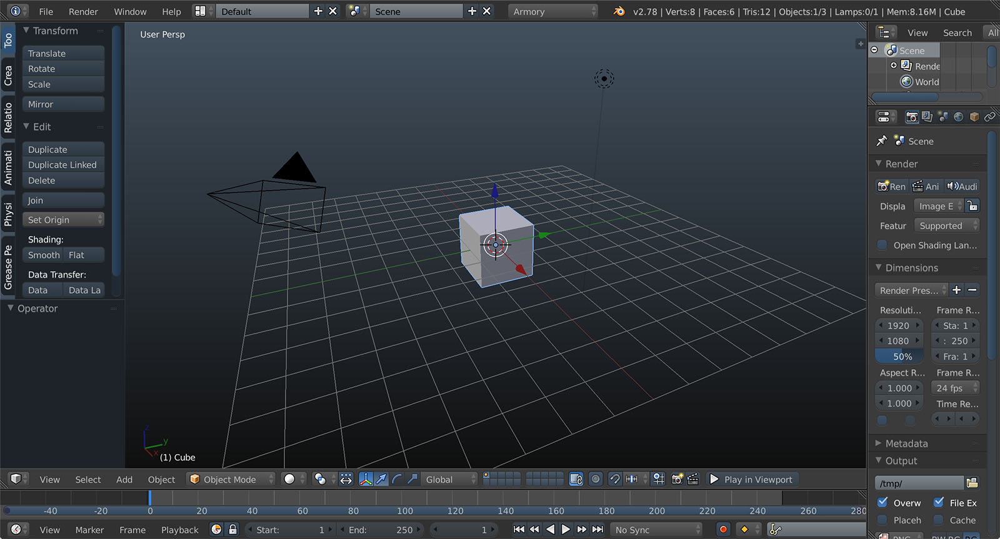
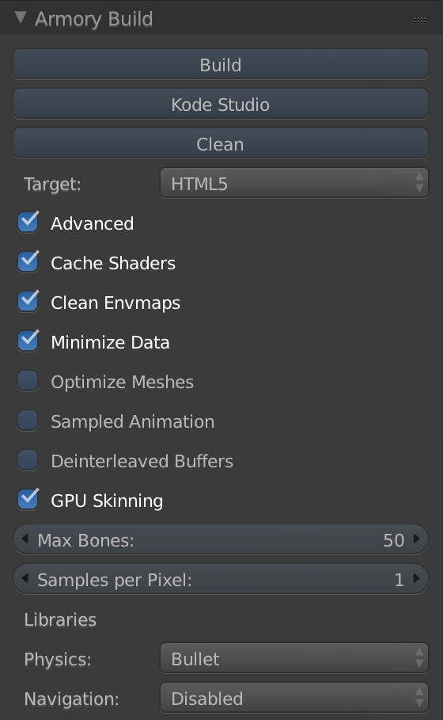
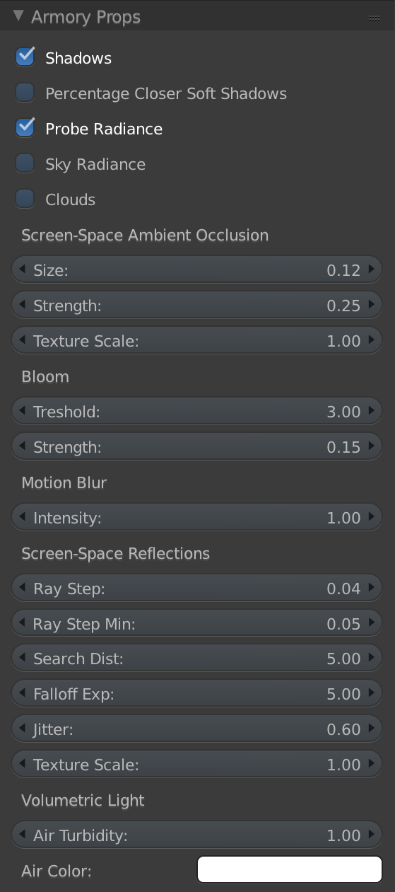
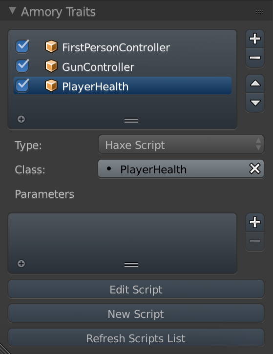

# User Interface

This page lists all user interface elements added to Blender by Armory. If you are already comfortable with essentials of Blender, this page serves as a good overview of Armory additions.

## 3D View

At the bottom of 3D viewport is the **Play in Viewport** button. Pressing this button will start Armory if it's not already running, and then proceeds to render the opened scene in the 3D viewport.

When running the player, **Stop** and **Pause** buttons are available. If there is a message received from any of the running scripts (using print() in Python, trace() in Haxe or console.log() in JavaScript), it will be displayed next to those buttons.

---

## Render panel

### Play

### Build

### Project

---

## Scene Panel

---

## World Panel

---

## Object Panel

### Props

### Traits

---

## Camera Panel

---

## Data Panel

---

## Material Panel

