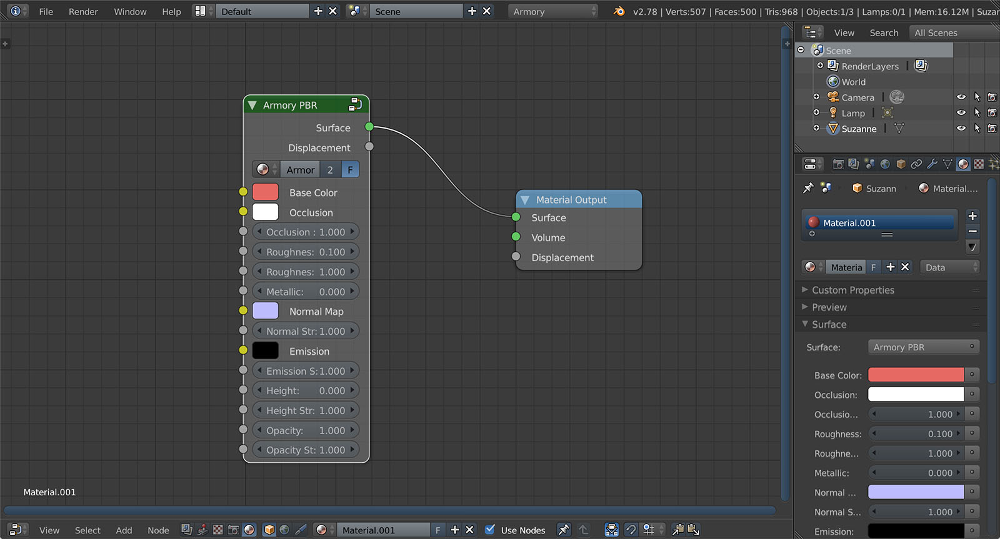
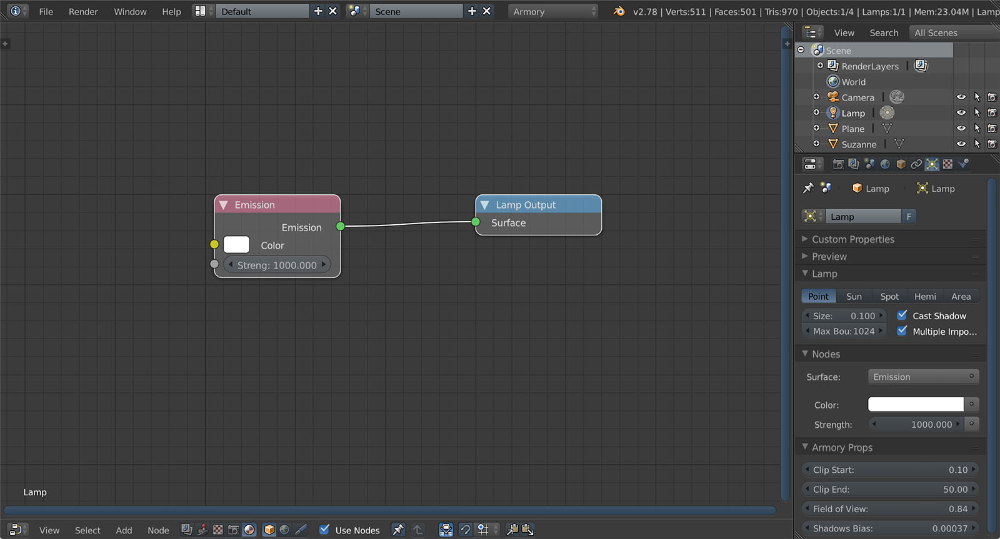
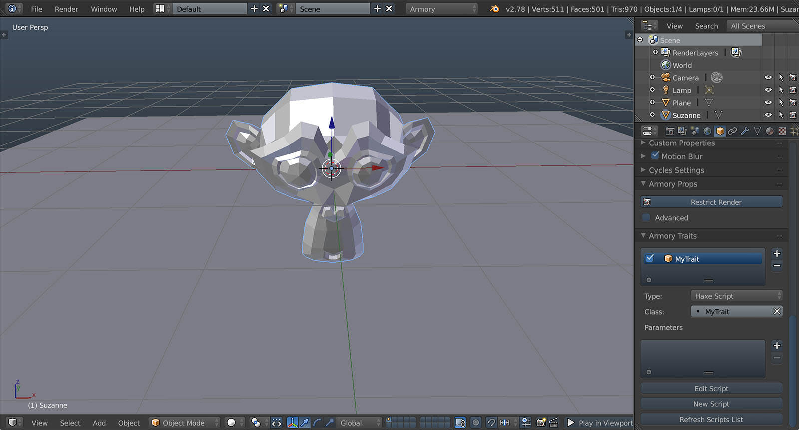
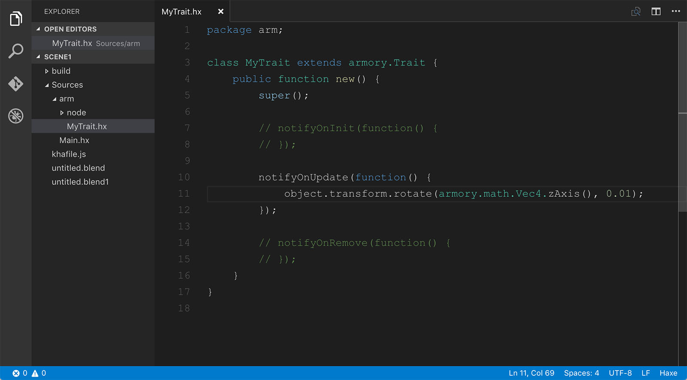
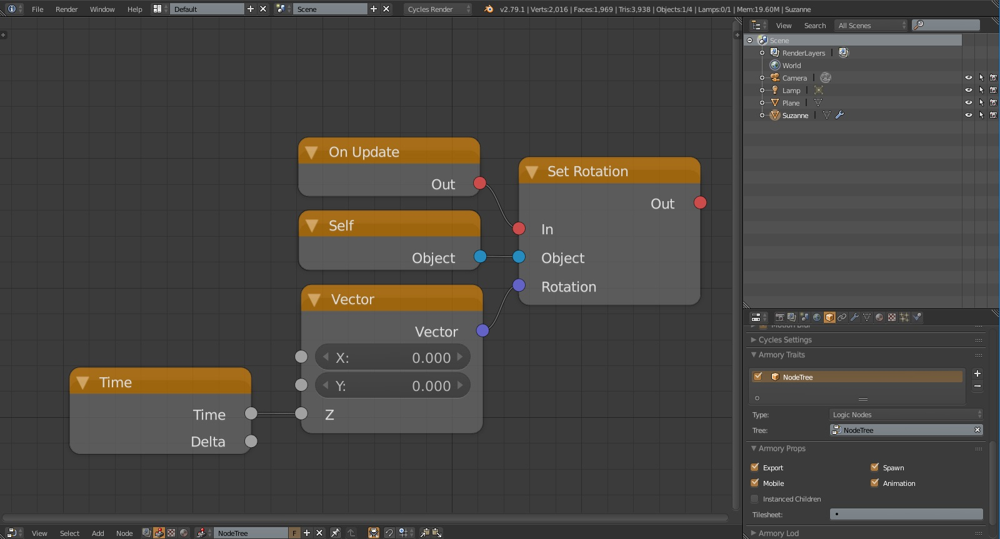
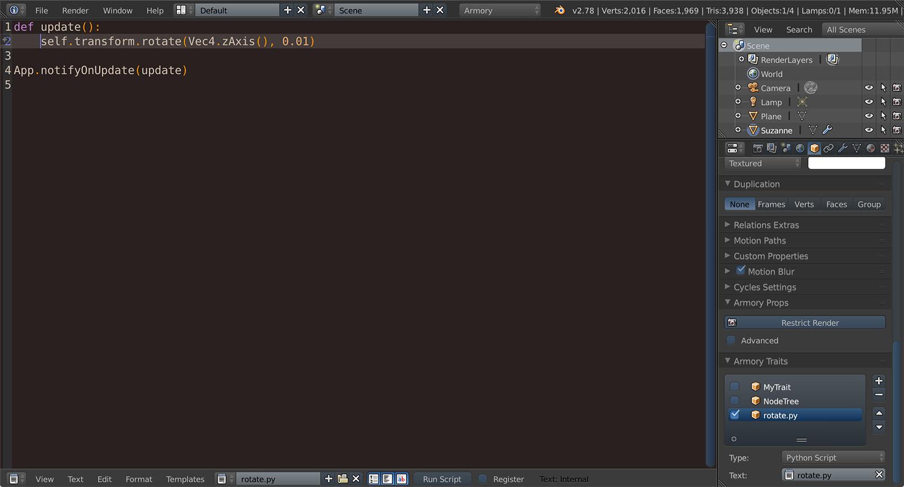
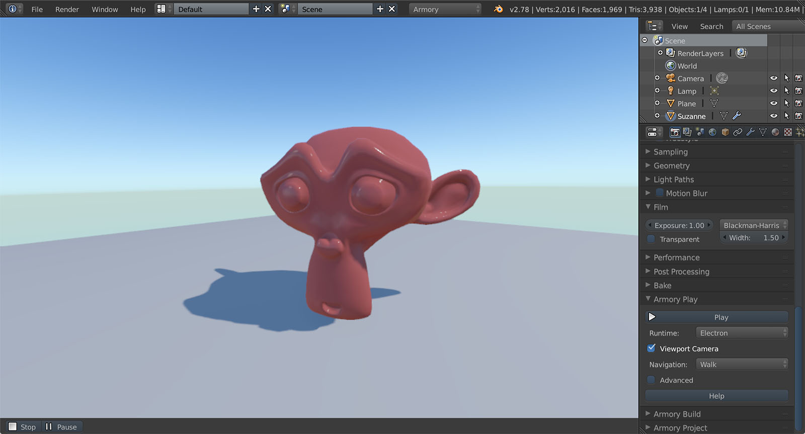

# Scene 1

This page describes how to build a simple scene with rotating monkey and interactive camera.

*Video version will be available soon.*

Boot up Blender located in Armory SDK and save the blend file.


Delete the cube and add monkey.


Create a new material for the monkey. Switch to node editor, delete the default **Diffuse BSDF** node and select **Add** - **Group** - **Armory PBR**. Preview version is still very limited and this node is recommended for all materials for now.



Switch to world nodes and add **Sky Texture** node. Set **Background** strength to 3.0. 


Select Lamp and set **Emission** strength to 1000.



Back in 3D view, place a plane under the monkey.

To make monkey rotate, we will add a new trait. Select monkey and locate **Armory Traits** in object properties. Hit **+** to add empty trait. Set **Haxe Script** as type. Hit **New Script** and confirm. Next, hit **Edit Script** and Kode Studio opens.



We want to rotate the monkey a bit every frame. Uncomment **notifyOnUpdate** function and make it look like this:

```haxe
notifyOnUpdate(function() {
    object.transform.rotate(armory.math.Vec4.zAxis(), 0.01);
});
```



If you want to use logic instead, switch to node editor and select logic nodes category. Click **New** and compose the node tree below. In **Armory Traits**, select **Logic Nodes** as type and set **Tree** entry.



<!--If you want to use Python instead.
-->

Switch back to 3D view, navigate to modifier properties and add **Subdivision Surface** modifier. Set Render subdivisions to 1.


In Render properties, locate **Armory Play** panel. Check **Viewport Camera** and select **Walk** as navigation. This will allow to control the camera with mouse and keyboard, similar to enabling walk navigation in viewport.

Ready to go! Hit **Play in Viewport** to run.

**Stop** the player and select **Browser** runtime in **Armory Play** panel. Hit **Play** and scene opens in the [browser](http://armory3d.org/demo/scene1)!



Get the blend file at [GitHub](https://github.com/armory3d/armory_examples/tree/master/scene1).
