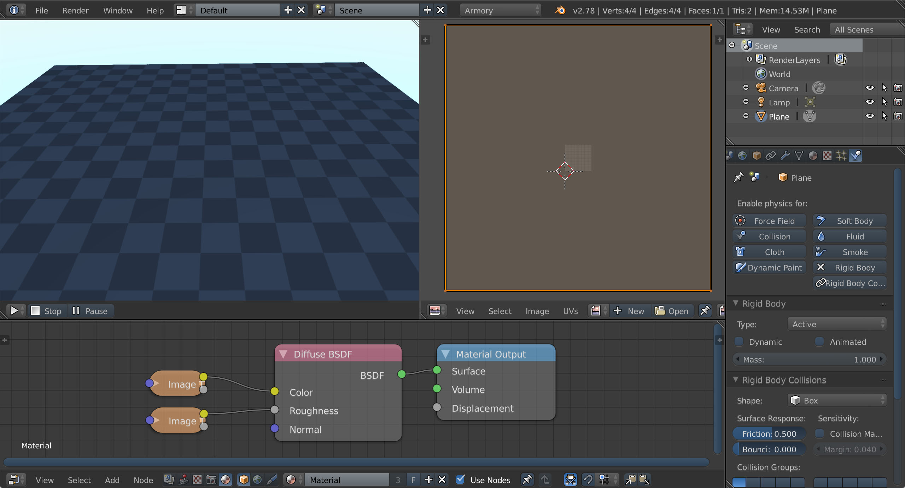

# Scene 2 - Physics

This page describes how to build a scene with **physics** and basic **first person camera**.

Boot up Blender located in Armory SDK and save the blend file.

Delete default cube and connect **Sky Texture** to **Background** in world nodes. 

We will prepare a checker-textured ground  that we will walk on.

Add a new **plane object** and scale it by a factor of 12. Enter **edit mode** and **unwrap** the plane. While still in edit mode, enter **UV/Image Editor** and scale the UV map by a factor of 10. Assign a new material to our plane and connect images to **Color** and **Roughness** sockets.

Color

Roughness

On to the physics part! With plane selected switch to **Physics** tab in **Properties** and hit **Enable physics for Rigid Body**. Next, uncheck **Dynamic** to prevent plane itself from falling down due to gravity and select **Box** shape.

Place a few more walls around. Similar to ground, setup a static rigid body as a Box shape. Objects can be freely scaled or rotated.

Now that the static part of scene is in place, create box and cylinder objects. This time, make sure that **Dynamic** is enabled when setting up rigid body. Set shapes to **Box** and **Cylinder**.

Feel free to stack quite a few instances on top of each other. To duplicate objects, use a **linked copy** (alt + d) to keep mesh data shared.

If we play the scene now, dynamic objects will fall down and collide with static surroundings!

As the last step, let's make a **first person camera** that we can use to walk around and interact with objects.

Create a shape which will represent the **body volume**. For simplicity, we use a **cube** and scale it along a Z axis. In **Physics tab**, enable rigid body and set **Capsule** as shape. Since we want to use this object for collision only, uncheck **Visible** property in **Object data - Armory props - advanced**. This way the cube will not get rendered.

Switch to **Object data - Armory Traits** and create new trait. Choose **Bundled Script** as Type and select **FirstPersonController**.

Lastly, select **camera** and rename it to "Head" (silly limitation that will be eventually resolved). Make camera a **child of body** and set it to preferable position.

Hit **Play in Viewport** and [push some objects around](http://armory3d.org/demo/scene2)!

Get the blend file at [GitHub](https://github.com/armory3d/armory_examples/tree/master/scene2).
