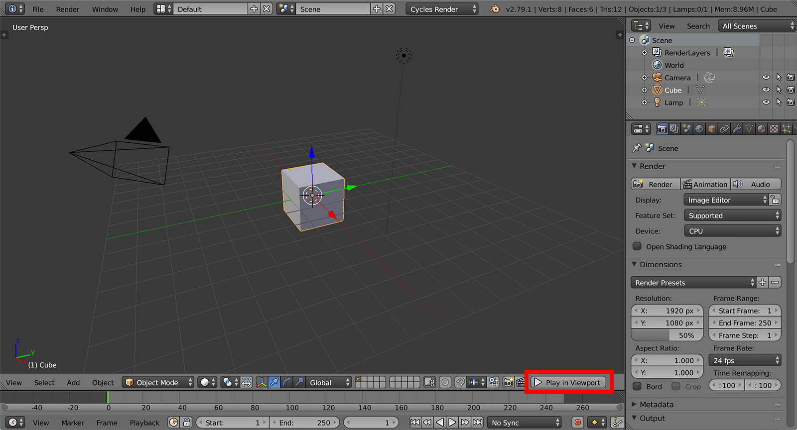
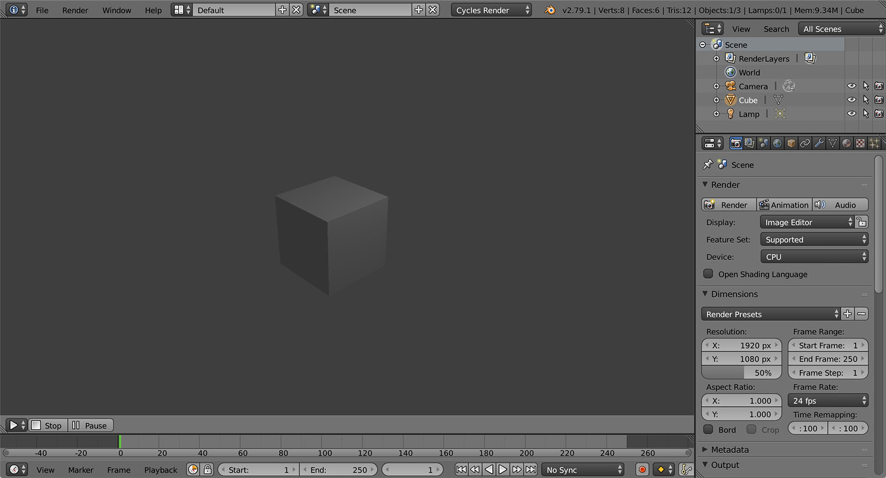

# Setup

Armory bundle comes with everything you need. Currently, **Blender 2.78** is used with **Armory player** built in. If you do not require the built-in player, Armory can be used as add-on only (instructions available soon). Armory sources are available at [GitHub](https://github.com/armory3d/).

- Unpack **Armory_version.zip** to your preferred location. On Windows, prefer a short path like 'C:\Dev\Armory'.
- In Blender, Select **File** - **User Preferences...** and navigate to **Add-ons** tab
- Search for **Armory** add-on and enable it
- Hit **Save User Settings** at the bottom

- To verify everything is working correctly, save your .blend file and hit **Play in viewport** button, located in the 3D view header.

- That's it! On Windows, it may take a few seconds the first time you run the player. Continue to the [building a scene](../essentials/buildscene.md) tutorial.

