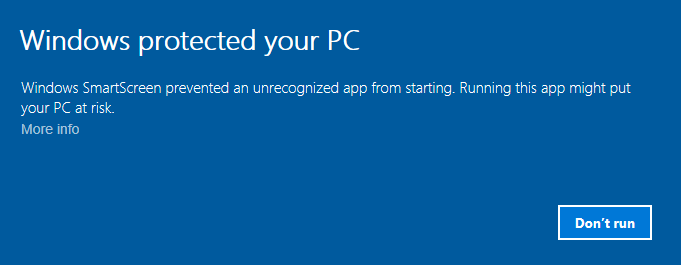

# Setup

Armory bundle comes with everything you need. Currently, **Blender 2.78** is used with **Armory player** built in. If you do not require the built-in player, Armory can be used as [add-on only](setupaddon.md). Armory sources are available at [GitHub](https://github.com/armory3d/).

- Unpack **Armory_version.zip** to your preferred location. On Windows, prefer a short path like 'C:\Dev'.
- Run Blender located in unpacked SDK. On Windows, you may need to enable it for the first time by clicking **More info** - **Run anyway**. 

- In Blender, Select **File** - **User Preferences...** and navigate to **Add-ons** tab.
- Search for **Armory** add-on and enable it.
- Hit **Save User Settings** at the bottom. That's it!

- To verify everything is working correctly, save your .blend file and hit **Play in viewport** button, located in the 3D view header.

- Continue to the [building a scene](scene1.md) tutorial. If you have any trouble setting things up, [contact us](http://armory3d.org/community.html)!

