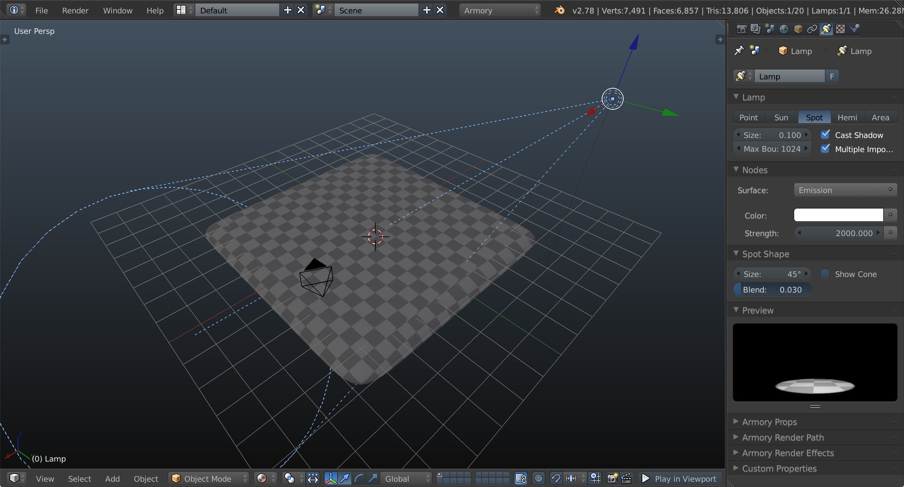
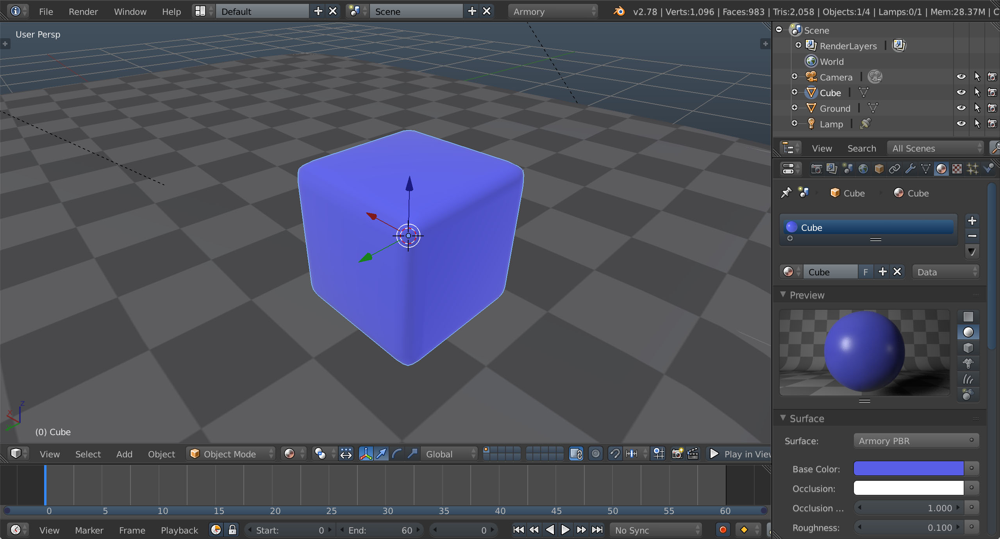
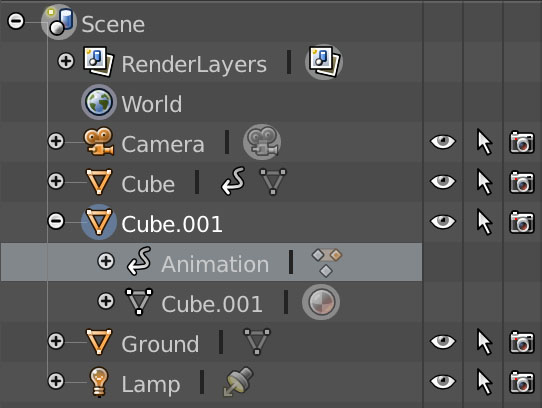
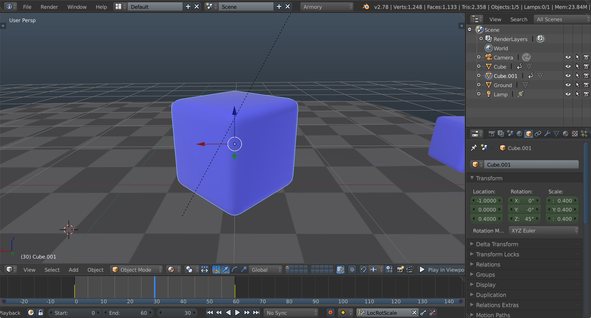
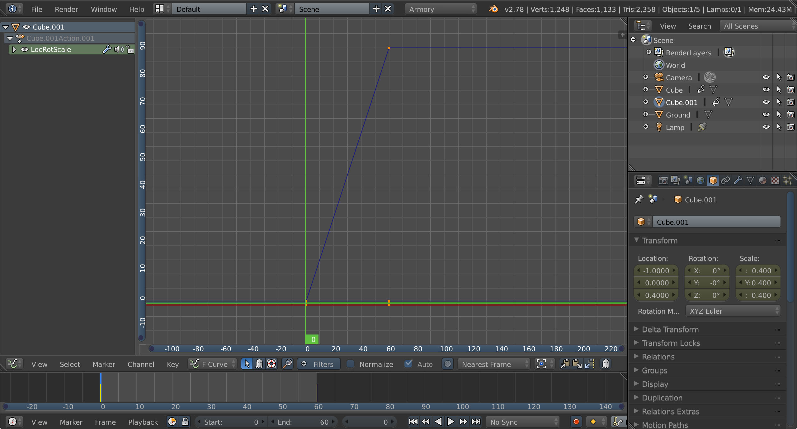
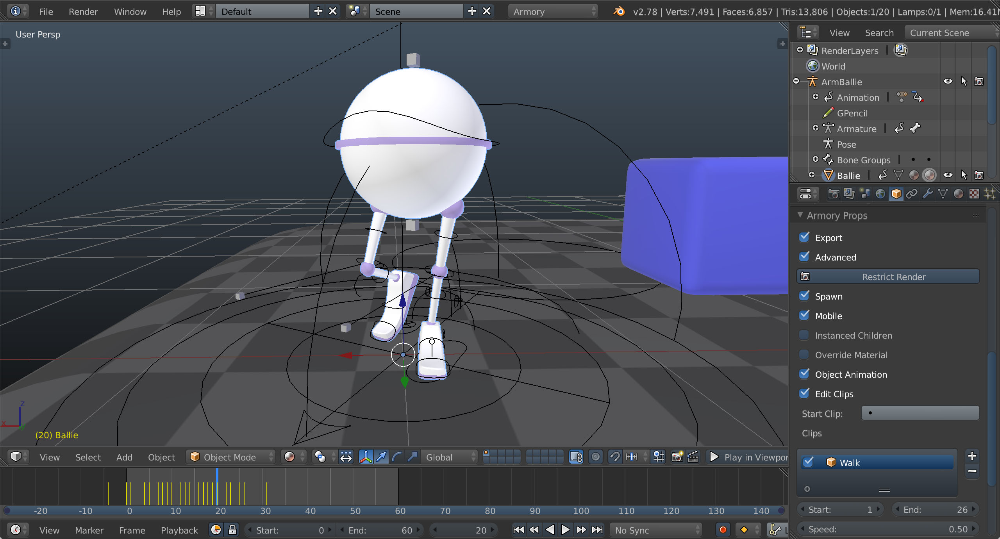
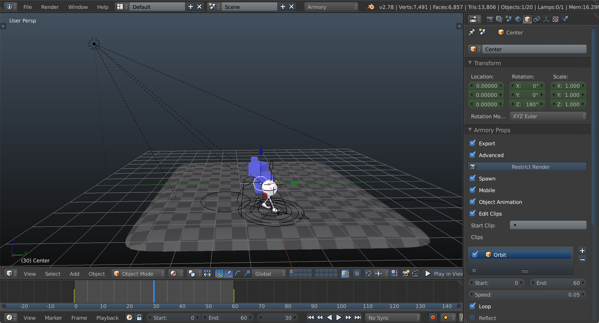
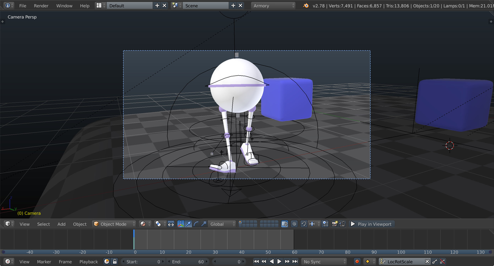
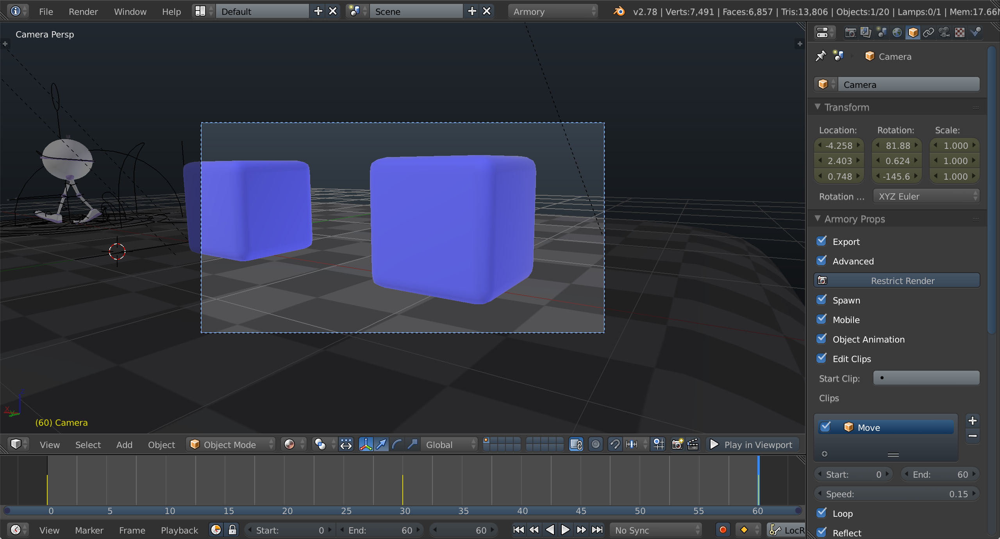

# Tutorial 3 - Animation

This page describes how to **animate objects** in the scene and setup **skinned characters**.

Boot up Blender located in Armory SDK and save the blend file. Place a plane object at the grid and change lamp type to **spot**. Create and connect **Sky Texture** to **Background** in world nodes.

Let's start with a cube (that's new!). Add Subdivision Surface and Smooth modifiers to make it look more polished and set color of the material.

We will animate the cube on timeline. Select frame 0 on the timeline and scale cube down to (0.001, 0.001, 0.001). Set Active Keying Set to Scale (alternatively to LocRotScale) and hit **Insert keyframes** (shortcut I). Next, select frame 60, scale cube back up and **Insert keyframes**.

Playing the scene now, we are already able to see cube booming up.

**Duplicate** the cube and select **Clear Animation Data** by right-clicking on the Animation entry of cloned cube in Outliner. This way we can start clean and record new animation.

Set frame to 0 and **Insert keyframes**. Next, set frame to 60, rotate cube 90 degrees on the Z axis and **Insert keyframes**.

By default, Blender will use **Bezier** interpolation mode. However, we want to achieve a constant, linear rotation of the cube. Switch to Graph Editor space, and select **Key - Interpolation Mode - Linear** (shortcut T).

Clone one more cube and clear it's animation data. Select frame 0, move cube forward to Y = 2 and **Insert keyframes**. Select frame 60, move cube back to Y = -2 and **Insert keyframes**.

Switch to Object tab in Properties, locate Armory Props and enable **Edit Clips** option. This allows us to make further adjustments to animation when running in Armory. Add new clip using **+** button and double click to rename this clip to Move. Enable **Reflect** option to let animation play both forward and backwards in succession.

We can also add **rigged and animated** models to the scene (you can import ArmBallie object from [final blend file](https://github.com/armory3d/armory_examples/tree/master/scene3)). Similarly, **Edit Clips** option can be used to quickly select frame portions that we are interested in. With armature object selected, it is also possible to include multiple actions using **Properties - Data - Armory Props - Edit Actions**.

Object animation also affects all of it's children. We can use this fact to easily orbit lamp object around a certain point in the scene. Add **new empty object** at the center and make it a **parent of lamp**.

With empty object selected, set frame to 0 and hit **Insert keyframes**. Rotate empty object 360 degrees on the Z axis and **Insert keyframes**. Set interpolation to **linear**, as discussed previously for cube 2. Add **new clip** for empty object and set **speed** to 0.05.

To step it up further, let's **animate the camera**. Set active frame to 0. In 3D View header, select **View - Cameras - Active Camera** and then **View - Navigation - Walk Navigation** (shortcut shift+f). Set starting camera position and hit **Insert keyframes**.

Set active frame to 30 and navigate camera to second position and **Insert keyframes**.

Set frame to 60, navigate camera to final position and **Insert keyframes**. Create a **new clip** for camera, set **speed** to 0.15 and enable **Reflect**.

And that is it! [Play the scene](http://armory3d.org/demo/scene3) to observe animations in real-time.

Get the blend file at [GitHub](https://github.com/armory3d/armory_examples/tree/master/scene3).
