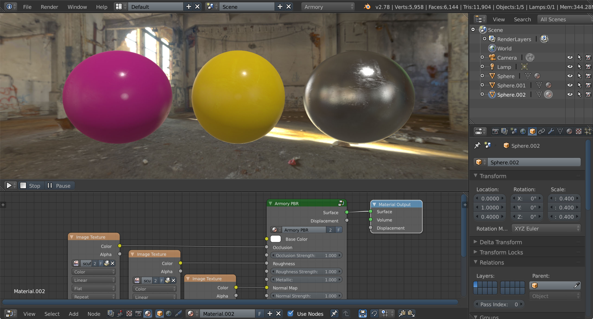
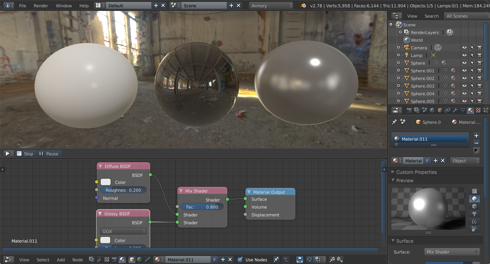
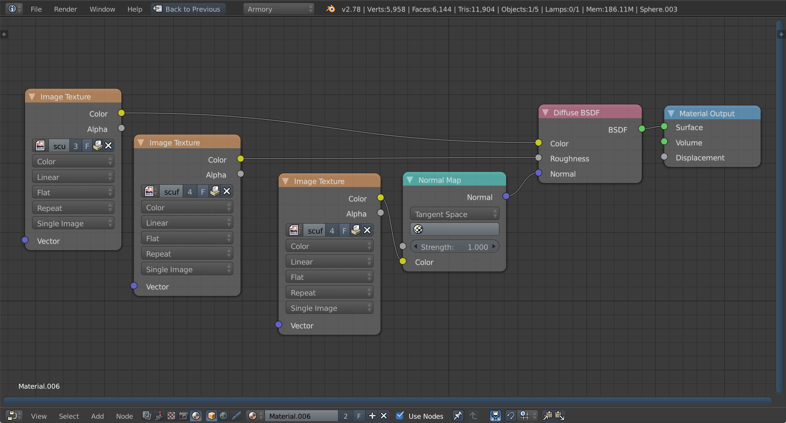
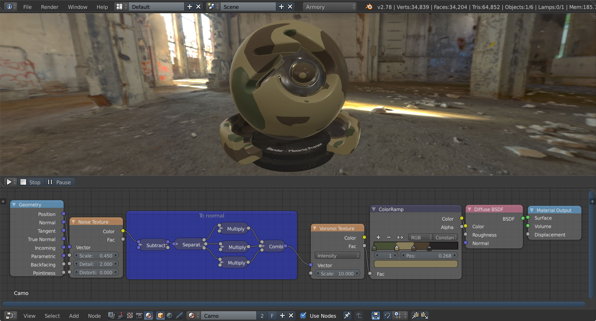

# Tutorial 4 - Materials

This page describes how to work with Armory **material system** using the **Cycles nodes**.

Start by adding an **Environment Texture** node in world nodes. For this tutorial, we use [Industrial Ruins from hdrlabs](http://www.hdrlabs.com/sibl/archive.html). In 3D viewport, check Properties panel (N) - Display - World Background to preview environment map.

Add a new **UV Sphere**. Set segments to 64 and rings to 32 in Tools panel (T). Set shading to smooth in Tools panel - Edit - Shading. Make sure **UV map** is present by unwrapping the sphere using **Mesh - UV Unwrap... - Sphere Projection**.

Create new material and switch to material editor. Select **Add - Group - Armory PBR** and connect **Surface socket** to the **Material Output**. Using **Armory PBR** node is recommended at all times. If we were to use Height maps for tessellated displacement, we would also connect Displacement sockets.

With **Armory PBR** node, it is easy to use **standard PBR materials** present in other real-time rendering engines.
For this tutorial, we use [Plastic Material from freepbr](http://freepbr.com/materials/worn-scuffed-plastic-pbr-material/). Drop textures into material editor and connect them to the **Base Color, Occlusion, Roughness and Normal Map sockets**.

We will create two more spheres. For the second sphere, same material setup is used with only **Base Color** texture changed. For the third sphere, **Base Color** texture is removed and **solid color** of (0.8, 0.8, 0.8) with **Metallic** set to 1.0 is used. Plenty of distinct materials can be achieved just by playing with these values.

It is also possible to build materials without the **Armory PBR** node. Note this setup is not yet calibrated and therefore the results may look different/wrong compared to **Cycles output**.

Switch to **second scene layer** and create **another 3 spheres**. For the first one, we use a **Diffuse BSDF** node with **Roughness** of 0.3. For the second sphere, **Glossy BSDF** with **Roughness** of 0.0 is used. For the third sphere, both **Diffuse BSDF** and **Glossy BSDF** are used through **Mix Shader** node.

Switch to **third scene layer** and create another 3 spheres.

We can quickly assemble non-metallic material using standard nodes. Connect **Color, Roughness and Normal textures to Diffuse BSDF sockets**. Note that **Normal Map** node is used to connect Normal texture.

It is recommended to **bake everything down to textures** and keep materials as simple as possible. However, if required and your performance budget allows, it is possible to use **fully procedural Cycles materials**. For this tutorial, we build a simple camouflage material. 

Get the blend file at [GitHub](https://github.com/armory3d/armory_examples/tree/master/tutorial4).
