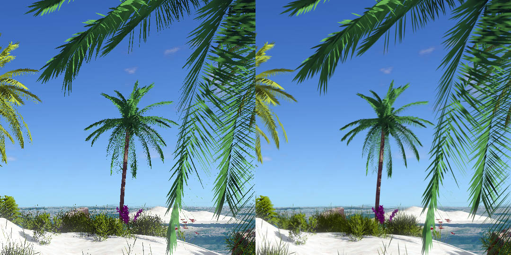

## Anti-aliasing (AA)

Aliasing has a big impact on the image quality. To fight it, Armory comes pre-equipped with several solutions. Each has varying quality / performance ratio.

- [No AA](#no-aa)
- [MSAA](#msaa)
- [FXAA](#fxaa)
- [Subpixel Morphological AA](#subpixel-morphological-aa)
- [Temporal AA](#taa)
- [Super sampling](#super-sampling)

**Problem:** Big degradation of quality because of jagged lines. **Solution:** anti-aliasing or super sampling.

### No AA

AA can be completely disabled. Currently, Forward Low render path has no AA enabled by default.

### MSAA

MSAA can be utilized for Forward Low render path, or any custom path that renders directly to framebuffer. MSAA can be enabled by setting **Render** - **Armory Build** - **Samples per Pixel**. Enter a value from 1 (disabled) to 16 (max quality).

### FXAA
The fastest technique, at a cost of blurring some elements. Used in Deferred Low path.

### Subpixel Morphological AA
Used in Deferred path.

### Temporal AA
Used in Deferred High path. For dynamic scenes, velocity buffer is required for repojection.

### Super-sampling
Very costly method producing very good results.

To enable super sampling, set screen scale in render nodes to 2.0. This effectively renders the scene at double the resolution.

