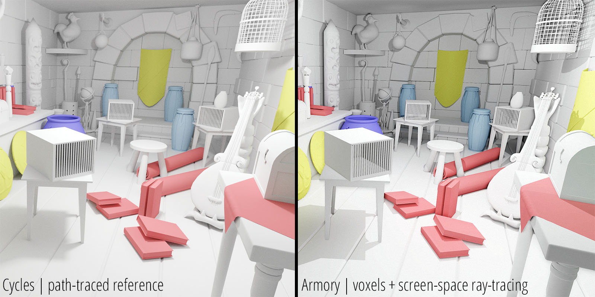
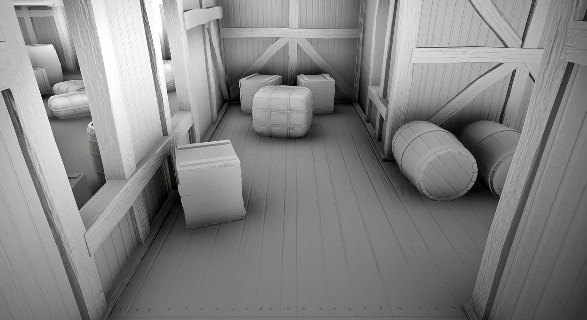
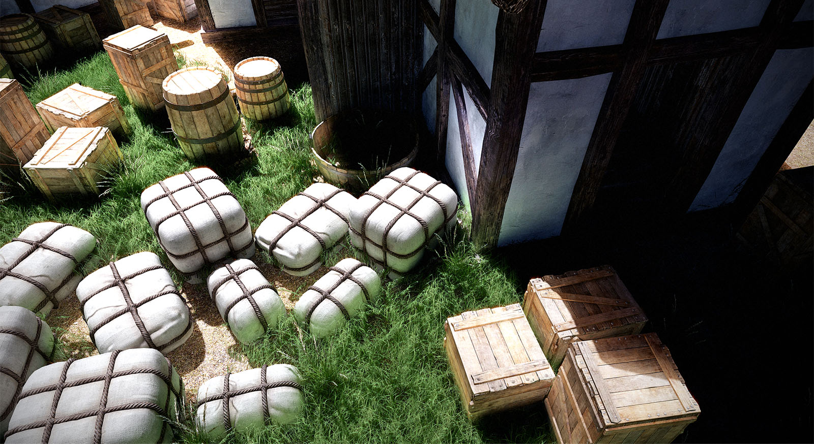
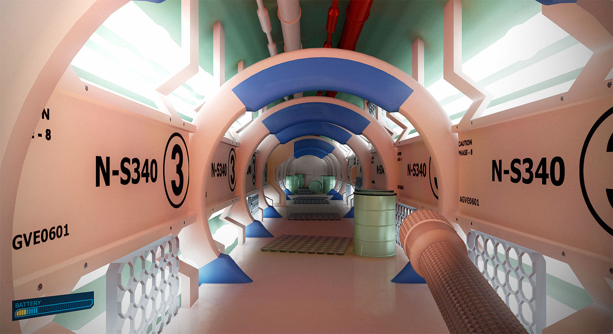
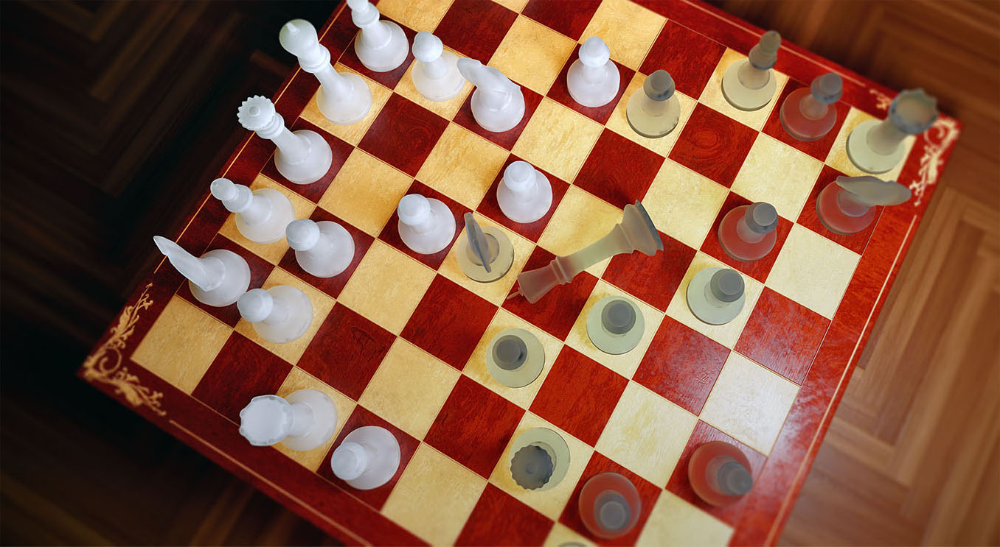
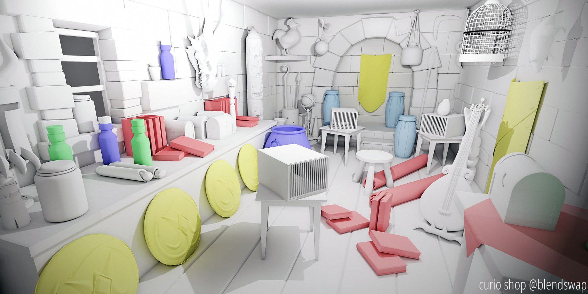

# Global Illumination Guide

This page presents a quick start guide to let you easily **setup global illumination** in your Armory projects.

Armory features a fully dynamic global illumination technique based on a combination of voxel cone-tracing and screen-space ray-tracing. First, the scene is voxelized and processed into a 3D texture. This data is then used to gather coarse lighting of the scene. Afterwards, screen-space ray-tracing is performed for detail.

- Download stand-alone demo [available soon].
- Example .blend available on [GitHub](https://github.com/armory3d/armory_calibration/tree/master/curio_shop).

## Requirements

- A graphics card with **OpenGL 4.5** support for voxelization.
- **Windows** (C++ and Krom targets) is supported, Linux coming up next.
- For Blender 2.79, launch project in **stand-alone window** (F5). In Blender 2.8 the global illumination also runs directly in viewport. 
- Fetch the latest Armory using the built-in [Armory Updater](http://armory3d.org/manual/dev/gitversion.html).

## Quick start

To enable global illumination in your scene using default settings, set `Properties - Render - Armory Render Path - Preset` to `Max`. Read on to learn about the configuration.

## Voxels

### Voxel AO

Set `Render - Armory Render Path - Global Illumination` to `Voxel AO`.

The cheapest way of utilizing voxels, usable for **ambient occlusion and shadows**. Runs faster and consumes less memory compared to Voxel GI.

Locate `Armory Render Props - Voxel GI` for settings.

- Control the quality using `AO Cones` property.
- Control the intensity using `Occlusion` property.
- Tweak tracing parameters using `Step, Range, Diffuse Offset` properties.

### Voxel GI

Set `Render - Armory Render Path - Global Illumination` to `Voxel GI`.

Voxel GI enables **indirect diffuse and specular lighting**. For performance, enable emission, refraction and shadows features only when needed.

Locate `Armory Render Props - Voxel GI` for settings.

- Control the quality using `Diffuse Cones` property.
- Control the intensity using `Diffuse, Specular, Occlusion` properties.
- Tweak tracing parameters using `Step, Range, Diffuse Offset, Specular Offset` properties.
- Control environment map contribution to indirect lighting using `Env Map` property.
- Control maximum tracing distance using `Range` property. Smaller distance benefits performance.

Teapots .blend available on [GitHub](https://github.com/armory3d/armory_examples/tree/master/voxelgi_teapots).

### Voxel Emission

Using `Voxel GI`, enable `Render - Armory Render Path - Emission Voxels`. **Emission material node** will now emit light into the scene.

Example .blend available on [GitHub](https://github.com/armory3d/armorbench1).

### Voxel Refraction

Using Voxel GI, enable `Render - Armory Render Path - Trace Refraction`. The surface of **translucent materials** will be traced using voxels.

Locate `Armory Render Props - Voxel GI` for settings.

- Tweak tracing parameters using `Refract Offset` properties. Increase this if you get artefacts on translucent surfaces.

### Voxel Shadows

Using Voxel GI, enable `Render - Armory Render Path - Trace Shadows`. **Soft shadows** will be traced using voxels.

Locate `Armory Render Props - Voxel GI` for settings.

- Tweak tracing parameters using `Shadows Offset` properties. Increase this if you get blocky shadows artefacts.

Chess .blend available on [GitHub](https://github.com/armory3d/chess_example).

### Volume setup

Locate `Render - Armory Render Path - Global Illumination` property. When set to `Voxel AO` or `Voxel GI`, **voxelization volume** can be configured. 

- Adjust `Dimensions` to control the volume size. Objects placed out of this volume will not contribute to global illumination. By default, dimensions are set to 16 - meaning a volume of 16x16x16 blender units gets voxelized. This conventionally covers the default 3D grid shown in 3D View viewport.
- Set `Resolution` to specify amount of voxels used for the volume. For performance, keep this at 128 or below.
- Reduce the `Resolution Z` multiplier to conserve memory if your scene is mostly flat on the Z axis (like a chess board). With `Resolution Z` set to 0.5, 16x16x8 dimensions will get voxelized.
- Enable `Revoxelize` property to update voxel volume every frame. In case of mostly static scenes, you can keep this off - moving objects will still receive indirect lighting, but will not affect it.
- With `Revoxelize` checked, enable `Dynamic Camera` to voxelize scene around the camera. As the camera moves, voxelization volume will move as well, making it possible to cover infinitely big scenes. With `Dynamic Camera` disabled, the volume at the scene origin(0,0,0) gets voxelized.

## Screen-space ray-tracing

### Ray-traced AO

Set `Render - Armory Render Path - SSGI` to `Ray-traced AO`.

**Ambient occlusion** will be traced.

Locate `Armory Render Props - SSGI` for settings.

- Control the quality using `SSGI Rays, Step Size, Max Steps` properties.
- Control the intensity using `Strength` property.

### Ray-traced GI

Set `Render - Armory Render Path - SSGI` to `Ray-traced GI`.

**Indirect diffuse lighting** will be traced.

Locate `Armory Render Props - SSGI` for settings.

- Control the quality using `SSGI Rays, Step Size, Max Steps` properties.
- Control the intensity using `Strength` property.

### Ray-traced Shadows

Small scale **contact shadows** will be traced.

Enable `Render - Armory Render Path - SSRS`.

Locate `Armory Render Props - SSRS` for settings.

- Increase `Ray Step` in case of artefacts.

### Ray-traced Reflections

**Local reflections** will be traced.

Enable `Render - Armory Render Path - SSR`.

Locate `Armory Render Props - SSR` for settings.

- Increase `Ray Step` in case of artefacts.

## Performance

Timings performed on GTX 1060. Rendering [curio shop](https://github.com/armory3d/armory_calibration/tree/master/curio_shop) scene, 498k tris, 104 objects, 64x64x32 voxel volume.

|           	| RTGI 	| VoxelAO     	| VoxelGI     	| Frame                	|
|-----------	|------	|-------------	|-------------	|----------------------	|
| 1920x1080 	| 2.2  	| 2.1 / 4.0 * 	| 4.0 / 6.1 * 	| 5.0 / 11.2 / 13.3 ** 	|

- `*` Revoxelized per frame
- `**` Base(deferred + temporal AA) / Base + RTGI + VoxelGI / + Revoxelized per frame

## Limitations

There are still severe limitations to be resolved.

- Flickering caused by moving objects, needs better filtering
- Only one lamp affects global illumination for now
- Only one bounce for now
- No multiple voxel volumes to handle big distances yet

## Baked lighting

With Blender we have a fully integrated path-tracing engine at hand. For static scenes, you can pre-bake lighting down into lightmaps using **Cycles**.

## Light probes

**Eevee** in Blender 2.8 spots a light probe support! Thanks to this, you can eventually expect Armory to implement this using the same user interface.
