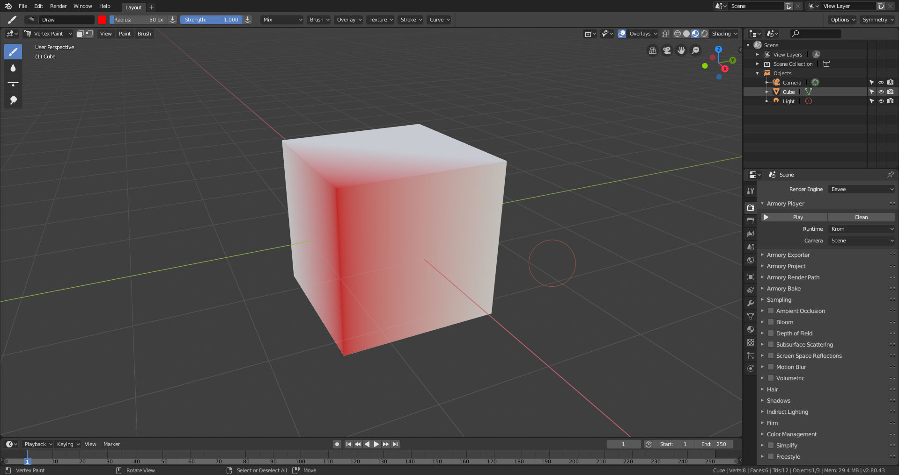
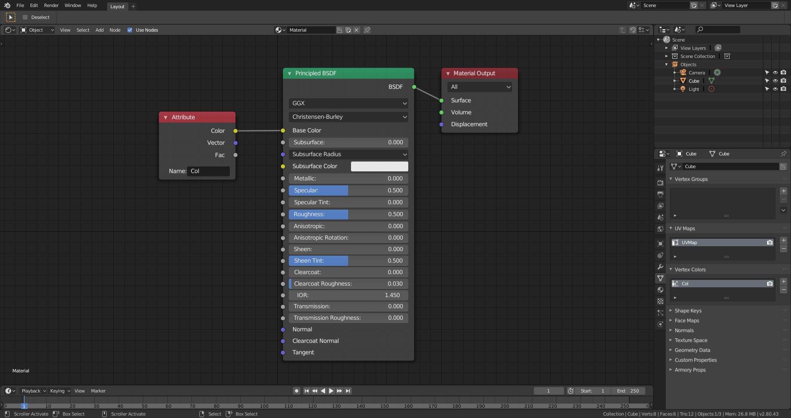
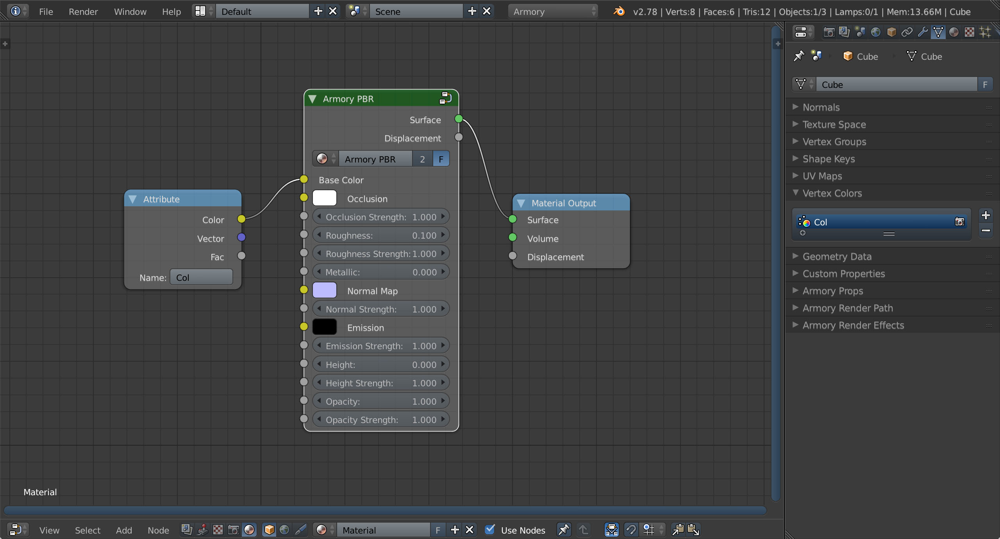
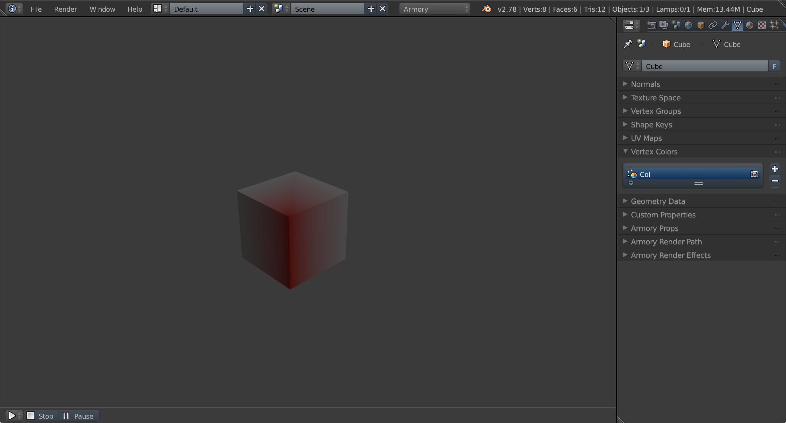

# Vertex Colors

This page describes how to render vertex colors associated with mesh data.

Start with default cube, enter **Vertex Paint** mode and paint one of the edges with red color.

To include vertex colors in material, create and connect **Attribute** node to **Color** socket. Only single vertex color set per mesh is supported currently.

Alternatively, using the Armory PBR node connect **Attribute** to **Base Color** socket.

Hit **Play in Viewport** to verify results.

If you are having trouble displaying vertex colors in more complex scenes, invalidating mesh cache may help in case Armory failed to register changes. Hit **Properties - Object data - Armory Props - Invalidate Cache**.
