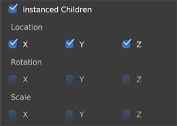
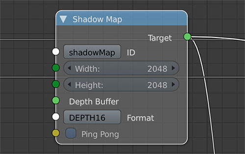
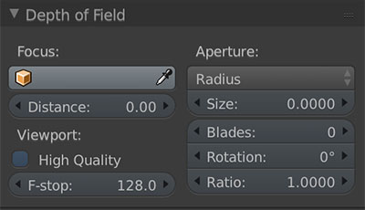

# Achieve best graphics

This page talks about ways to improve graphics quality of Armory rendered scenes. Note that this may also considerably hurt performance as a result.

We will take the scene below and go through it's creation steps. Not the prettiest one but it may potentially resemble work on game environment, so we will take it.

## 1. PBR Assets

We need assets! Ideally the ones with PBR maps. We connect those to *Armory PBR* node group. For *occlusion, roughness, metallic and height*, single channel textures can be used to save memory.

Connecting *Height* socket will enable tessellated displacement. To configure amount of tessellation, locate **Height map** in **Armory Props** panel.

## 2. Scene design

 We need lot's of objects to build lush scenery. To render the same object over and over again with varied location, **instanced rendering** is used. This gives a significant performance boost.
 
 Select desired object and enable **Object data - Armory Props - Instanced Children**.

Create linked duplicates and parent them under original object.

## 3. Rendering
For higher precission shadows, we increase **Shadow Map** resolution in render path nodes. On top of that, tweaking *Clip Start, Clip End and FoV* in **Armory Props** to better resemble light volume can boost the precission further.

For higher quality shadows, enable **Percentage Closer Soft Shadows** flag in **World Data - Armory Props**. Lamp size also has to be increased.

For **anisotropic texture filtering**, set Texture interpolation to **Smart**. To enable this for all textures at once, check **Force Anisotropic Filtering** in **World Data - Armory Props - Flags**.

For better diffuse light shading, enable **Oren Nayar Diffuse** in  **World Data - Armory Props - Flags**.

## 4. Effects

...

Enable Film Grain in **World Data - Armory Props**.

Set depth of field *distance* and *aperture size* in **Camera Data - Depth of Field**.

...

## 5. Anti-aliasing

Enable best possible [AA method](../graphics/antialiasing.md).

## 6. Global illumination

... 

Set up global illumination.

...

---

## Additional resources

<iframe width="560" height="315" src="https://www.youtube.com/embed/R1-Ef54uTeU" frameborder="0" allowfullscreen></iframe>
