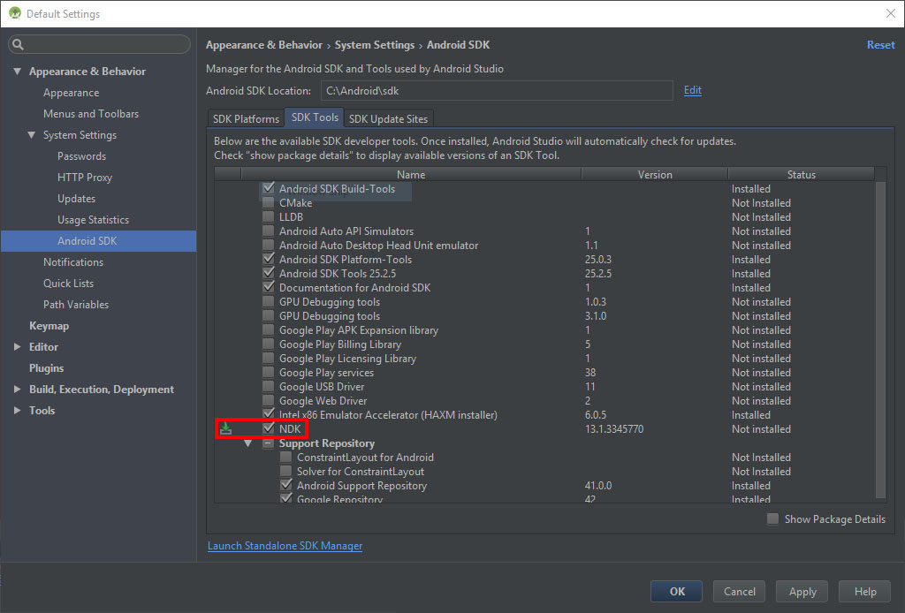

# Contents

This section covers Android specific topics.

# Building for Android

Before running on mobile device, make sure the project is optimized to run smooth on your target hardware. It is recommended to select *Forward Low* preset in  *Camera - Properties - Camera Data - Armory Render Path*. Additionally, simplifying **materials, textures and geometry** may be needed.

## Native (C++)

Select *Android* in *Properties - Render - Armory Project - Target*. Hit *Build* to generate android project files.

To proceed, install and run [Android Studio](https://developer.android.com/studio/index.html). Select *Open an existing Android Studio project*. The project is located at *your_blend_file_location/build/android-native-build/your_project_name*

Once the project is loaded, make sure to install *NDK* by opening up *SDK Manager - SDK Tools* from Android Studio.

Android Studio may ask you to install additional tools. Continue till you resolve all dependencies. To speed up the build process, select 'armv7' target from the Build Variants tab. **Connect your device** and press *Run*. Build process can take up to several minutes when compiling for the first time.

Note: If you experience build errors, make sure the 'armv7' build variant is selected.

Once compiled, the project will launch on your device!

## Krom

TBD
