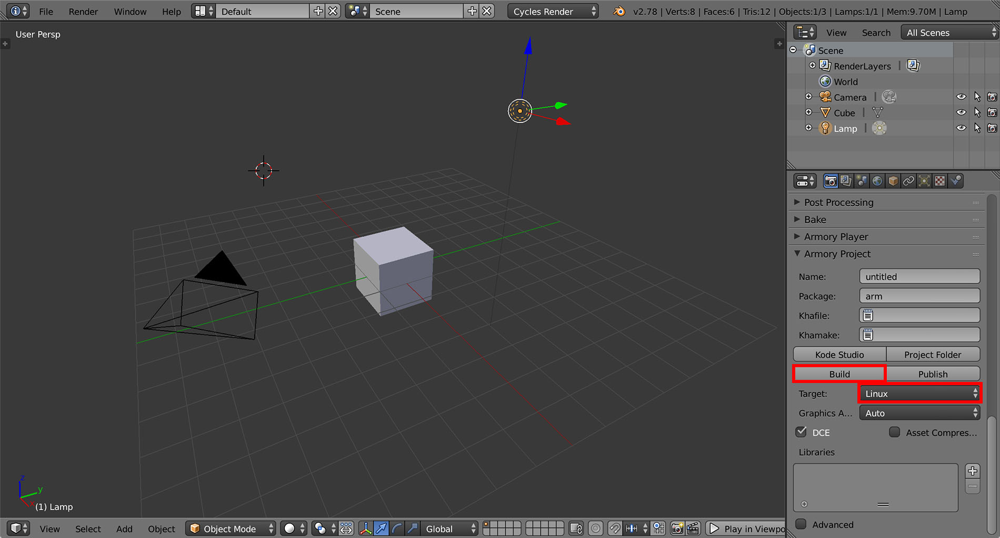

# Contents

This section covers Linux specific topics.

## Native target

For the C++ compilation to succeed you might need to install some additional packages - read more at [Kha/Wiki](https://github.com/Kode/Kha/wiki/Linux).

Select *Linux* in *Properties - Render - Armory Project - Target*. Hit *Build* to generate project files.

Afterwards, you can compile the project using the generated makefile or using the [Code::Blocks](http://codeblocks.org) project located at *your_blend_file_location/build/linux-build*
