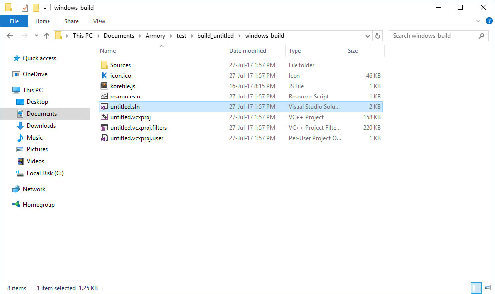
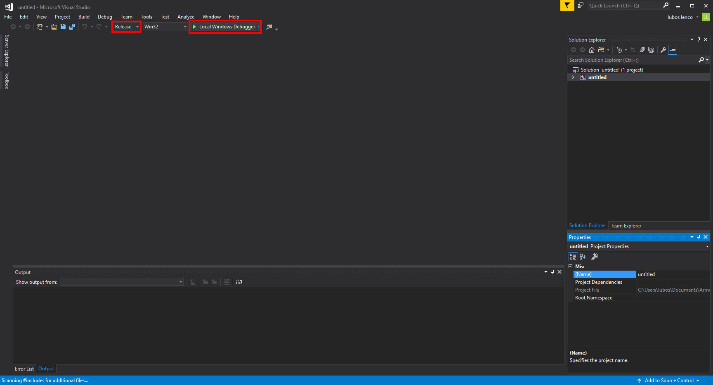
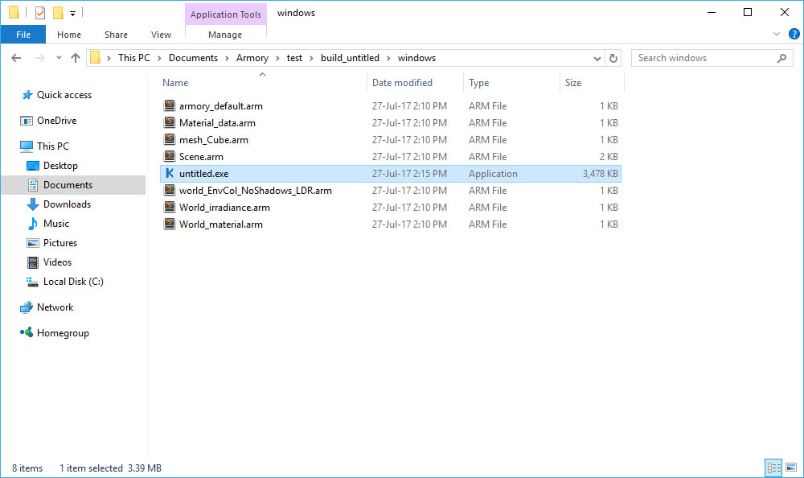

# Contents

This section covers Windows specific topics.

# Building for Windows

## Native (C++)

Create a new preset in *Properties - Render - Armory Exporter* and select Windows target. Hit *Publish* to export Visual Studio project files.

To proceed, install [Visual Studio](https://www.visualstudio.com/vs/community/). Make sure to install components for compiling C++ code. Once installed, open the project located at *blend_file_location/build_projectname/windows-build/project_name.sln*.

Next, you can test, debug and profile your project in Visual Studio. When you are ready to export final binary, switch to Release mode and build the project.

Once the build process finishes, copy the resulting binary from *Release* folder (in this case *untitled.exe*) -

- to the *blend_file_location/build_projectname/windows* folder which also contains game assets.

You can now package and distribute this folder!

## UWP (Universal Windows Platform)

TBD

## Krom

TBD
