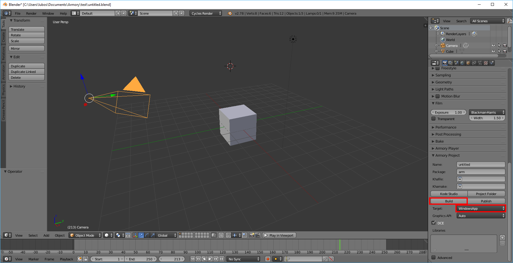

# Contents

This section covers Xbox specific topics.

# Building for Xbox

## UWP (Universal Windows Platform)

Select *WindowsApp* in *Properties - Render - Armory Project - Target*. Hit *Build* to generate Visual Studio project files.

To proceed, install [Visual Studio](https://www.visualstudio.com/vs/community/). Make sure to install components for developing UWP applications. Once installed, open the project located at *your_blend_file_location/build/windowsapp-build/your_project_name.sln*.

Next, you will need to set-up your Xbox for windows app development. The process is quite straightforward - follow [this guide](https://docs.microsoft.com/en-us/windows/uwp/xbox-apps/getting-started). 

