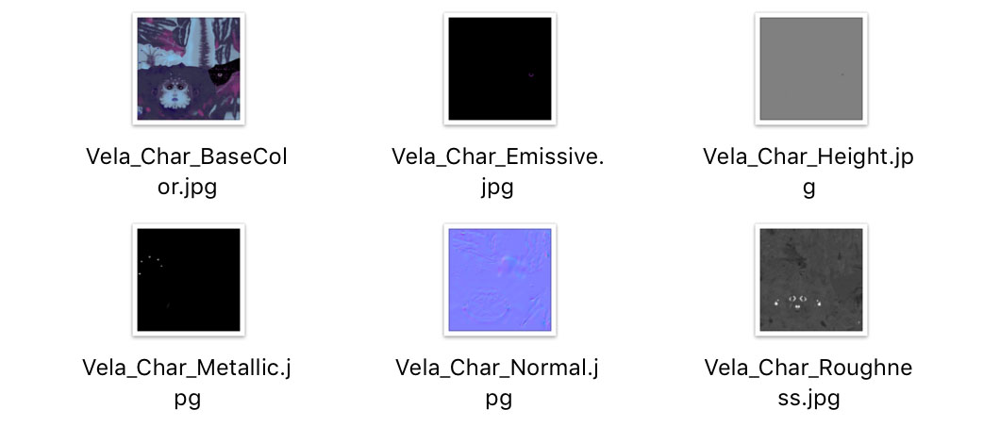
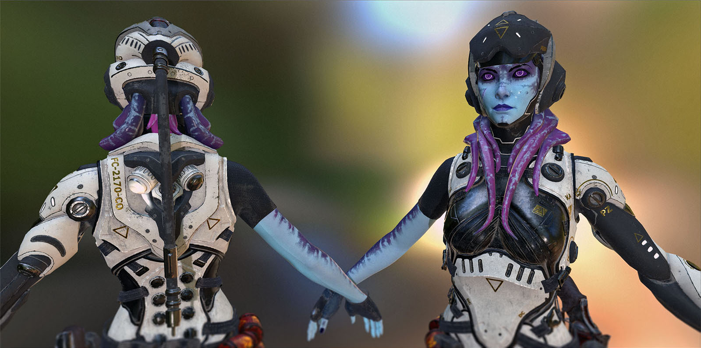
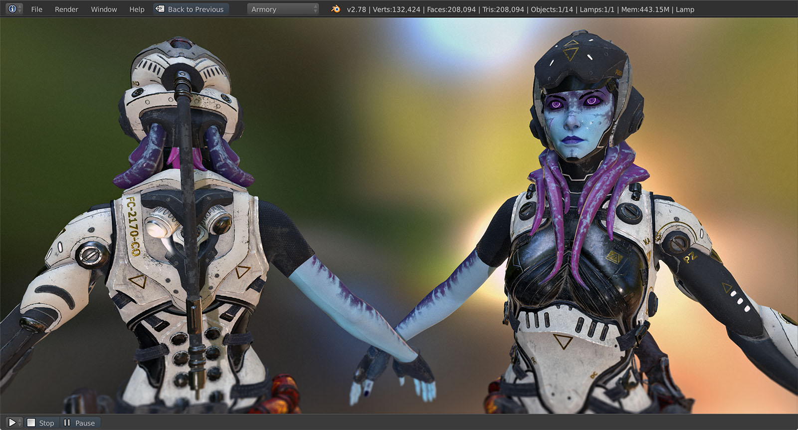

# Substance Painter

This page describes how to use Armory with [Substance Painter](https://www.allegorithmic.com/products/substance-painter) for **3D texture painting**.

*Note this topic is handling Armory specifics only and general Substance Painter knowledge is required.*

Import your geometry prepared for texture painting into Substance Painter. For this tutorial, we will use the [Vela Template](https://share.allegorithmic.com/libraries/1633).

Once the model is painted, we want to import resulting textures back into Armory. Click **File - Export Textures...**

Choose a destination for file export and select **PBR MetalRough** config (or a compatible roughness-metallic model like Sketchfab). Hit **Export**.

Locate exported textures in specified destination.

In Blender, select painted model and enter **material editor**. Choose **Add - Group - Armory PBR** and connect it to the **Material Output**. Drop exported textures from Substance Painter into material and connect them to the appropriate sockets (base color, occlusion, normal, roughness, metallic..). Eventually, we plan to automate this step using a PBR material importer.

With materials & lighting set and playing the scene, you will be presented with the output similar to the Substance Painter viewport.

